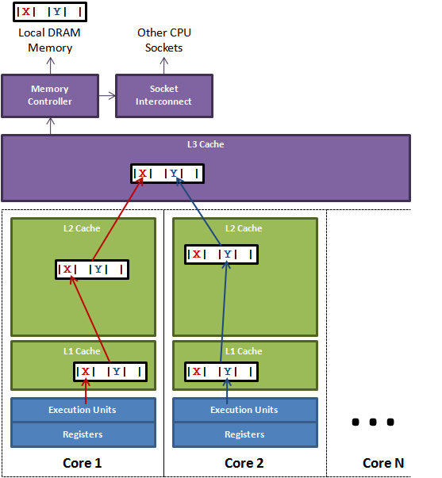

**前言：**最近看了很多关于volatile和synchronized的博客，很多说法理解不一，故此，这里整理我对于这两个关键字的理解。

## 基础介绍
Java 关键字`volatile`可以让变量的修改在多个线程之间可见，即cpu核心1对`volatile`修饰的变量进行修改会立即刷新该变量在L2，L3，RAM中的值！同时，如果其他cpu核心也缓存了该变量，那么其他cpu对应缓存会立即失效并更新相应缓存。
这里，还一种说法是，volatile修饰的变量不会被缓存，读写直接在RAM中进行，我认为是错误的理解！


### 1. 伪共享 or 缓存一致性协议
当多线程修改互相独立的变量时，如果这些变量共享同一个缓存行，即被放到同一个缓存行中，如果其中一个核心1修改了其中一个变量A，那么另一个有相同缓存行的核心2的缓存会失效需要重新加载缓存，即使变量A的修改不影响核心2的正确执行，这就导致了性能损失，这就是伪共享。也称作:缓存一致性协议!


一致协议的两种实现（copy自network）：
1. 一种处理一致性问题的办法是使用Bus Locking（总线锁）。当一个CPU对其缓存中的数据进行操作的时候，往总线中发送一个Lock信号。
这个时候，所有CPU收到这个信号之后就不操作自己缓存中的对应数据了，当操作结束，释放锁以后，所有的CPU就去内存中获取最新数据更新。
但是用锁的方式总是避不开性能问题。总线锁总是会导致CPU的性能下降。所以出现另外一种维护CPU缓存一致性的方式，MESI。
2. MESI是保持一致性的协议。它的方法是在CPU缓存中保存一个标记位，这个标记位有四种状态:
M: `Modify`，修改缓存，当前CPU的缓存已经被修改了，即与内存中数据已经不一致了
E: `Exclusive`，独占缓存，当前CPU的缓存和内存中数据保持一致，而且其他处理器并没有可使用的缓存数据
S: `Share`，共享缓存，和内存保持一致的一份拷贝，多组缓存可以同时拥有针对同一内存地址的共享缓存段
I: `Invalid`，实效缓存，这个说明CPU中的缓存已经不能使用了

CPU的读取遵循下面几点：
如果缓存状态是I，那么就从内存中读取，否则就从缓存中直接读取。
如果缓存处于M或E的CPU读取到其他CPU有读操作，就把自己的缓存写入到内存中，并将自己的状态设置为S。
只有缓存状态是M或E的时候，CPU才可以修改缓存中的数据，修改后，缓存状态变为M。

这样，每个CPU都遵循上面的方式则CPU的效率就提高上来了。

### 2. 重排序
1. 指令重排序
cpu会对互相不影响的指令进行重排序，也即代码执行的顺序可能和我们写的不一样！
2. JVM重排序
JVM会对对象中的变量进行排序，因为对象的起始地址以8字节对齐，所以字段顺序会以`double/long，int/float，short/char，bool/byte，引用，子类字段`重新组织。
3. 内存屏障
为了阻止cpu对指令的重排序，可以采用`内存屏障`（一组处理器指令）阻止指令重排。


## volatile
1. 任何线程对volatile变量的修改会对其他缓存该变量的线程立即可以见！强制刷新缓存到主内存！
2. JVM会在volatile变量处插入一个内存屏障，防止指令重拍序！
3. 某个线程对volatile的修改，会导致其他cpu高速缓存中对应该变量的缓存行失效（CPU的L1或者L2缓存中对应的缓存行无效，即缓存一致性协议）！
4. **volatile只能保证变量对各个线程的可见性，但不能保证原子性**，因为对一个变量的修改包括读取变量值，修改值，刷入主内存！
三步完成，如果线程1读取到值后，线程2对变量值进行修改且刷入主内存，这时线程继续修改，并刷入主内存，显然会出现错误，这三步操作就不具有原子性！

volatile使用场景：
1. 状态标记，方法只被执行一次，如spring的refresh事件中首次启动执行某个任务一次！
2. 双重检验锁，单利模式。
3. `ConcurrentHashMap`中很大遍历都采用volatile修饰，如：Node的value和next指针都是volatile；数组槽，成员变量等。
4. `Atomic`系列的类中值都用volatile修饰，以便`compareAndSet`时候拿到的是最新的值。


## synchronized
### 1. Lock和Synchronized区别

1. `Synchronized`同步代码块，不能保证等待线程进入同步块的顺序。
2. `Synchronized` 不接受超时，不能被中断！
3. `Lock`中`unLock()`必须放到`finally{}`中，需要收到释放锁，`Synchronized`自动释放锁。
4. 锁竞争小时的性能：`Synchronized >= atom >= Lock`，竞争激烈时： `atom > Lock > Synchronized`


### 2. Synchronized的理解

synchronized加锁的类型
1. 对象锁: `synchronized (this)`或`synchronized (personObject)` ,`synchronized`修饰的成员方法，都是对象锁；
2. 类锁: `synchronized (A.class)` 和 `synchronized`修饰的静态方法，都是类锁；
3. `synchronized`包含的代码块。`synchronized (A.class){}`是类锁, `synchronized (this){}`是对象锁.

#### synchronized特点
1. 不论锁的是什么, 并不影响`类`或`对象`中没有用`synchronized`修饰的`方法`,`变量`被其他线程`访问`和`修改`.
2. `synchronized`锁住的`方法,代码块,对象`中的`变量`不会受到 `synchronized`的控制, 可以被其他线程随意读写.
3. **当一个线程获得了对象锁(类锁)，其他线程不能访问其他需要对象锁(类锁)的方法或代码块**
4. **对象锁和类锁，二者不冲突，当一个线程获得了A的对象锁，其他线程可以访问A中需要类锁的方法或代码块**
5. `synchronized (this){}`不能用于静态方法中, 但是`synchronized (A.class)`却能用于成员方法中,加的是类锁.

### 3. 锁的实现
对象锁和类锁有两种实现方式：方法上的synchronized是基于方法区中`ACC_SYNCHRONIZED`标志位实现，synchronized修饰的方法块基于`monitorenter`,` monitorexit `语义实现！
这两种实现方式，在重量级锁上，都依赖于操作系统提供的实现（管程(monitor)底层数据结构维护着请求该锁的线程的队列，及相关信息）。
> 重量级锁依赖于操作系统实现，加锁需要从用户态转换到内核态加锁，这就需要操作系统进行一次上下文切换，另外加锁、释放锁会导致比较多的上下文切换和调度延时，等待锁的线程会被挂起直至锁释放。在上下文切换的时候，cpu之前缓存的指令和数据都将失效，对性能有很大的损失。

#### synchronized修饰的成员方法和静态方法
成员方法： 

```
public synchronized void method(int, java.lang.String);
    flags: ACC_PUBLIC, ACC_SYNCHRONIZED
    Code:
      stack=2, locals=4, args_size=3
        0: aload_2       
        ...
        10: return   
```
静态方法：
```
public static synchronized int method2(int);
    flags: ACC_PUBLIC, ACC_STATIC, ACC_SYNCHRONIZED
    Code:
      stack=2, locals=1, args_size=1
         0: iload_0       
         ...
         4: return
```
获取锁和释放锁是在方法调用和方法返回的时候执行的，方法执行中如果抛出异常，那么锁会在抛出异常时释放。
JVM可以从方法常量池中的方法表结构(method_info Structure) 中的 ACC_SYNCHRONIZED 访问标志区分一个方法是否同步方法。


#### synchronized修饰的成员方法代码块和静态方法代码块
```
        5: monitorenter  
        ...
        12: monitorexit   
        13: goto          21
        ...     
        17: aload_1       
        18: monitorexit   
        ...     
        20: athrow        
        21: return
```
`monitorenter`,` monitorexit `语义是基于堆中实例化对象的对象头中的锁标志位实现。

其中，`ACC_SYNCHRONIZED`和`monitorenter，monitorexit`，在JVM上的语义不同但是在底层锁实现是一样的，因为`Class`被ClassLoader加载到内存中也是一个对象，也有对象头！
实例对象由：`对象头`，`实例变量`，`填充对齐数据`组成。
对象头由：`MarkWord`（存储对象的hashCode、锁信息或分代年龄或GC标志等信息），`Class Metadata Address`（指向方法区class的指针）

#### 锁原理锁优化
jdk1.6之前synchronized属于重量级锁，效率低下，因为监视器锁（monitor）是依赖于底层的操作系统的Mutex Lock来实现的，而操作系统实现线程之间的切换时需要从用户态转换到核心态，
这个状态之间的转换需要相对比较长的时间，时间成本相对较高。
重量级锁的实现是借助操作系统实现的，多种叫法：监视器/管程/monitor。
 如果被`Synchronized`修饰的方法或代码块，JVM探测出其没有竞争，会进行锁消除，即不使用锁！
jdk1.6之后JVM对synchronized的锁实现优化，首先在没有锁竞争的情况下加**偏向锁**，当另一个线程申请该锁时升级为**轻量级锁**，当同一时刻多个线程申请同一个锁时，JVM将该锁升级为**自旋锁**，当自旋一定次数后，升级为**重量级锁**，也就是依赖操作系统的`Mutex Lock`来实现。


## 参考
1. http://blog.csdn.net/javazejian/article/details/72828483
2. http://blog.csdn.net/javazejian/article/details/72772461
3. https://yq.aliyun.com/articles/46661

