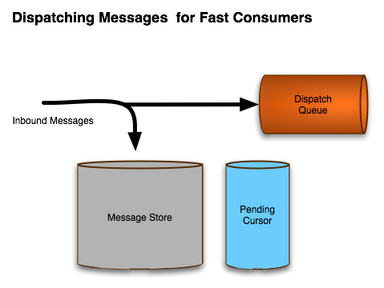
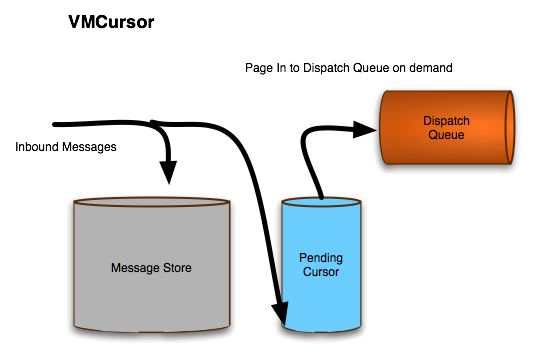
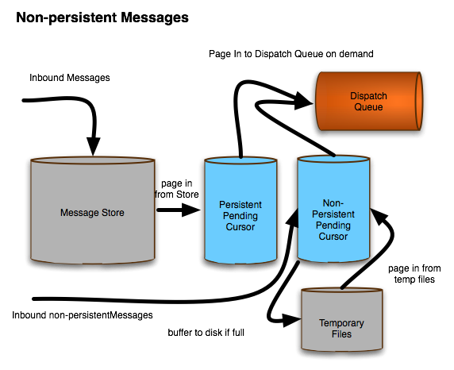

**前言:**通常在开发Mq时,我们有必要关注一个点:消息从producer发往broker的速度,consumer消息的消费速度.
而上面的点又涉及到:游标策略(Message Cursors), prefetchSize和producerWindowSize,生产者流控制(Producer Flow Control)等.
对于消费者的Flow Control是prefetchSize,消息消费速度涉及到Multi-thread(这点在《Client客户端的线程资源》中有提到).
本文主要focus生产者流控制!


## 一. 生产者流量控制(Producer Flow Control)
在4.x的版本里ActiveMq是通过基于TCP的流量控制,但是在当有多个消费者和生产者共用这个连接的时候可能会出现死锁;所以5.x开始,引入了针对某个producer的流量控制策略,通过broker返回producer Ack的方式实现.
流量控制触发条件:
1. 当memoryUsage,storeUsage,tempUsage达到设置的阈值(即磁盘,内存容量触顶)时触发.
2. 正常情况下broker不会控制producer的发送消息速度.
3. 同步消息(持久化消息默认采用同步发送,除非启用`useAsyncSend`)默认支持Flow Control,异步消息(非持久化消息默认采用异步发送)由于发送一条消息时不用等到任何ACK回来,所以默认不支持Flow Control. 但是我们可以设置`connctionFactory.setProducerWindowSize(1024000);`实现`ProducerWindowSize`表示在等到broker的ACK回来之前,可以发送多少bytes的消息.如果想让非持久化的消息也能立即被通知(因为非持久化消息默认异步发送),可以在`connectionFactory`中设置`alwaysSyncSend`.

### 设置方法:
默认情况下,当broker发现满足Flow Control条件后,直接阻塞producer,直到memoryUsage,storeUsage,tempUsage有空余空间.

1. 启用,禁用Flow Control
启用:在`activemq.xml`文件的`policyEntry`中设置: `<policyEntry queue=">" producerFlowControl="true" optimizedDispatch="true" memoryLimit="16mb">`
禁用:
 ```
<destinationPolicy>
 <policyMap>
   <policyEntries>
     <policyEntry topic=">" producerFlowControl="false"/>
   </policyEntries>
 </policyMap>
</destinationPolicy>
 ```
另外一种方法,是启用`Message Cursors`策略,这个下面讲.


2. 流量控制策略
在`activemq.xml`文件的`systemUsage`中设置:  `<systemUsage sendFailIfNoSpaceAfterTimeout="3000">` 或`sendFailIfNoSpace="true"`  Client端抛异常的方式.
`sendFailIfNoSpaceAfterTimeout`和`sendFailIfNoSpace`区别在于,当`systemUsage`达到设置的limit后, 前者等待一段时间再抛异常, 后者直接抛异常.

3. 异步消息设置
`connctionFactory.setProducerWindowSize(1024000);` 异步模式下, 在broker没有全部返回ack之前, producer能发送给broker的数据大小.
Tip:非持久化消息默认异步发送，异步发送模式下ProducerWindowSize参数才起作用，可以在ack没有回来时，继续想broker发送消息（不阻塞）的大小。
Tip：默认情况下，非持久化消息、事务内的消息均采用异步发送；对于持久化消息，则采用同步发送。

## 游标(Message Cursors)
触发游标策略：消费者处理消息速度赶不上生产者。
### storeCursor（store based cursor）
broker默认情况下不使用游标，默认是直接将持久化消息分发到对应的消费者的Dispatch队列，如下图:

  



上图，是5.x的默认方式：当消费者的消费速度能赶上生产者的速度，那么对于持久化消息会先持久化到磁盘，然后直接发给`Dispatch Queue`（左图）。
当消费者速度赶不上生产者时，会有部分消息pending在broker，此时broker默认的做法是启用游标（Cursor），由于还有很大旧消息未发送到consumer，且`Dispatch Queue`大小固定，新来的消息不能直接发给`Dispatch Queue`，此时会启用游标策略，将新来的消息持久化到磁盘后，发给`Cursor`。实际上这里`Cursor`起的是一个缓冲区作用，解决生产者和消费者速度不均衡的问题！
Tip：上图`Message Store`不一定是磁盘哈，当使用的是levelDB时，就是内存memstore，不过会持久化LOG到磁盘。
Tip：这里`Pending Cursor`的实现是磁盘文件，配置文件中的`tempUsage`的地方！
与非持久化消息处理对比：



默认情况下，非持久化消息由于不持久到磁盘，当消费者速度慢于生产者后，会启用游标策略，将一部分消息持久化到临时文件中。
注意这里不是在当内存空间不够时才去持久化到一个临时文件中。
参考：
>  Note that, since the introduction of the new file cursor in ActiveMQ 5.x, non-persisted messages are shunted into the temporary file store to reduce the amount of memory used for non-persistent messaging. As a result, you may find that a queue's memoryLimit is never reached, as the cursor doesn't use very much memory. If you really do want to keep all your non-persistent messages in memory, and stop producers when the limit is reached, you should configure the <vmQueueCursor>.

### VM Cursor和File based Cursor
简单介绍下另外两张游标策略：`VM Cursor`和`File based Cursor`
1. `VM Cursor`策略是将`pending Message`全部放在磁盘中，如果`memoryUsage`已满则会阻塞生产者。在存在较慢消费者或消息消费耗时场景慎用！优点是速度快！
2. `File based Cursor`策略是 `VM Cursor`的改进，当`memoryUsage`达到极限时，将消息持久化到磁盘临时文件。用于持久化消息较慢，且消费者消费消息较快的场景，且对于某些队列可能会有突发的大量消息产生的场景。

### 配置
每个队列都有一个独立的`dispatch Queue` 和`pending Queue`，所以这里配置`pending Queue`：
```
<destinationPolicy>
      <policyMap>
        <policyEntries>
          <policyEntry queue="org.apache.>">
            <deadLetterStrategy>
              <individualDeadLetterStrategy queuePrefix="Test.DLQ."/>
            </deadLetterStrategy>
            <pendingQueuePolicy>
                <vmQueueCursor />
            </pendingQueuePolicy>
          </policyEntry>
        </policyEntries>
      </policyMap>
 </destinationPolicy>
```
上述配置，使用`vmQueueCursor`，所有的pending消息都会保持在内存中（默认是将pending消息放到临时文件中），并且当内存达到限制时会阻塞生产者！


## 二. 消费者流控制
1. 消费者比较简单通过设置`prefetchSize`控制：
消费者消费消息有同步方式（通过receiver()方法同步获取），异步方式（设置Listener异步回调），Broker与Client间消息交互有pull，push两种方式；
当`prefetchSize=0`时Client每次调用receiver()方法去Broker啦取一条消息，当`prefetchSize>=1`时，Broker每次主动往prefetchSize的buffer中push数据。
注：使用`receive()`时，prefetchSize可以为0和任意大于0的值，当使用MessageListener异步获取消息时，prefetchSize值必须 >=1，如果设置0，会抛异常。
2. 通常消费者消费某个destination的消息是单线程的，这样会导致消息处理速度较慢，若要加快消息处理速度可以采用多线程方式，具体见`开发中遇到的问题(八)`