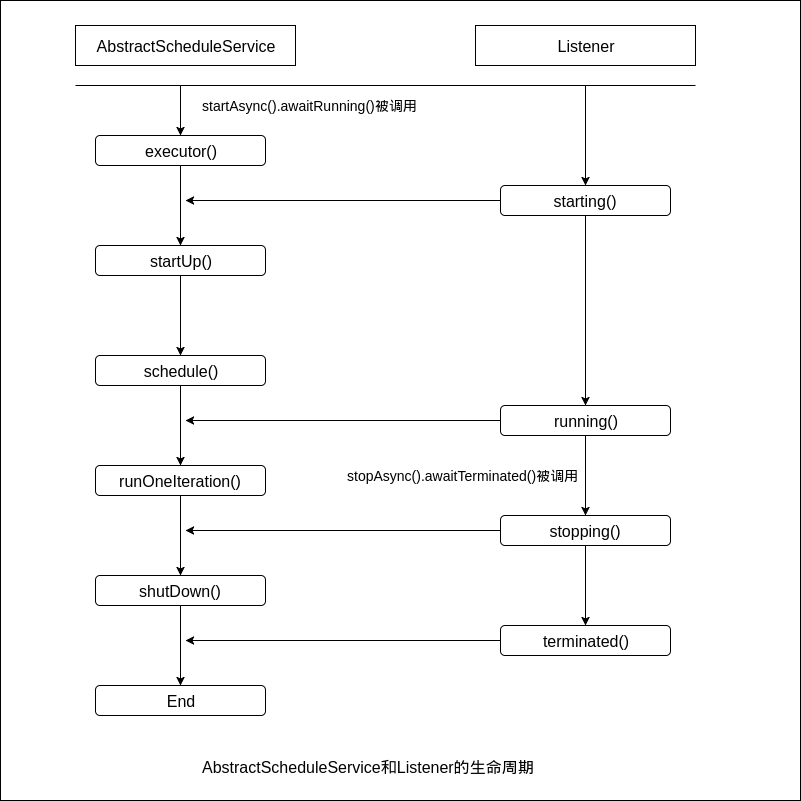

**前言：** AbstractScheduledService是guava提供的一个定时任务的实现，提供更简便的使用，并提供任务生命周期的监听。

# AbstractScheduledService和Listener的生命周期


# AbstractScheduledService概述
1. `AbstractScheduledService`抽象类提供和JDK提供的`ScheduledExecutorService`相同的功能，其优势在于，能够管理执行线程的生命周期，并提供监听器。
2. 继承 `AbstractScheduledService`必须实现以下两个方法
```
public class TaskScheduler extends AbstractScheduledService {
    @Override
    protected void runOneIteration() throws Exception { /*执行逻辑*/ }
    protected Scheduler scheduler() {
        //Scheduler.newFixedDelaySchedule(1,1, TimeUnit.SECONDS);
        return Scheduler.newFixedRateSchedule(1, 1, TimeUnit.SECONDS);
    }
}
```
其中，`scheduler()`方法除上面两种方法外，我们可以自定义执行计划，比如想cron表达式那样执行！`runOneIteration()`中是你的业务逻辑代码！
Tip：后面将给出如何实现`cron`的调度！

3. 还可以覆写以下方法
```
public class TaskScheduler extends AbstractScheduledService {
    //可以自定义ScheduledExecutorService,默认是newSingleThreadScheduledExecutor
    protected ScheduledExecutorService executor() { return super.executor(); }
    //自定义定时任务线程名
    protected String serviceName() { return super.serviceName(); }
    //关闭定时任务线程时调用
    protected void shutDown() throws Exception { super.shutDown(); }
    //开启定时任务时(startAsync().awaitRunning())调用
    protected void startUp() throws Exception { super.startUp(); }
    @Override
    protected void runOneIteration() throws Exception { /*执行逻辑*/ }
    protected Scheduler scheduler() {
        //Scheduler.newFixedDelaySchedule(1,1, TimeUnit.SECONDS);
        return Scheduler.newFixedRateSchedule(1, 1, TimeUnit.SECONDS);
    }
}
```

`executor()` 方法是定义定时任务的线程池，默认使用`Executors.newSingleThreadScheduledExecutor`，如果我们需要将多个任务放在同一个线程池中执行可以覆写此方法！

由于一个`TaskScheduler`对象代表一个任务，所以默认情况下多个任务开启多个`Executors.newSingleThreadScheduledExecutor`线程池！且每个线程池始终之后有一个线程来执行定时任务，即使一个任务的执行时长大于执行周期，也只会有一个线程顺序执行这些任务(虽已达到执行时间但是仍要等到上一次任务执行结束)！

另外，覆写`executor()`方法，可以多个`TaskScheduler`对象共用同一个线程池，如`Executors.newScheduledThreadPool(10);`，初始开启10个线程（即：`corePoolSize=10，maximumPoolSize=Integer.MAX_VALUE，DelayedWorkQueue()）`，即10个线程不会被销毁，如果有`>10`的`TaskScheduler`存在，则会将任务放入`DelayedWorkQueue()`延时队列，直到执行时间到或有空余线程，如果线程不足该任务会等到有空余线程后才执行！
所以，只推荐仅在线程资源紧缺时使用：
```
public class TaskScheduler extends AbstractScheduledService {
    public static final int THREAD_NUM = 2;
    private String taskName;
    private static final ScheduledExecutorService executorService = Executors.newScheduledThreadPool(THREAD_NUM);
    public ScheduledExecutorService executor() {
        addListener( new Listener() {
                    public void terminated(State from) {  executorService.shutdown();  }
                    public void failed(State from, Throwable failure) { executorService.shutdown();  }
                },executorService);
        return executorService;
    }
    protected String serviceName() {
        return taskName;
    }
}
```
注：这里`addListener`目的是，任务关闭或失败后(`terminated`和`failed`)，关闭线程池！
`serviceName()`，线程每到生命周期的一个阶段，线程池都会更新线程名（`serviceName() + " " + Stat`的格式），所以无需自定义`ThreadFactory`！

4. 启动关闭
启动：`taskScheduler.startAsync().awaitRunning()`
启动时添加监听器：`taskScheduler.addListener(new ScheduleListener(), listenerService);`
关闭：`taskScheduler.stopAsync().awaitTerminated()`，该方法会等到本次任务执行完毕后才退出（不执行下一周期任务）！并不是异步关闭,当前线程会等待直到正在执行的任务执行完毕!
Tip：`listenerService`是一个新线程池专门执行监听！

# 监听器ScheduleListener实现

我们可以根据业务逻辑实现定时任务生命周期的监听：
```
private static class ScheduleListener extends Service.Listener {
    public void failed(Service.State from, Throwable failure) {}
    public void running() { logger.info("Listener:开始运行,监听线程:{}", Thread.currentThread().getName()); }
    public void starting() { logger.info("Listener:任务启动,当前监听定时任务线程:{}", Thread.currentThread().getName()); }
    //只可能有两种状态:RUNNING,STARTING
    public void stopping(Service.State from) { logger.info("Listener: 开始停止,线程:{}", Thread.currentThread().getName()); }
    //State:转换成TERMINATED状态,之前的状态
    public void terminated(Service.State from) {
        logger.info("Listener:任务终止. State:{}", from.toString());
    }
}
```

## 自定义scheduler()实现
下面给出借助spring 的cron解析类，实现cron形式的定时任务调度：
```
// 解析cron表达式,每次执行完任务都要重新获取并设置延迟,每个任务对应一个CronTrigger实例
private final static class CronTrigger extends AbstractScheduledService.CustomScheduler {
    private final CronSequenceGenerator sequenceGenerator;
    private Date nextExecutionDate;
    private CronTrigger(String cronExpression) {
        this.sequenceGenerator = new CronSequenceGenerator(cronExpression);
    }
    public Date getNextExecutionDate() {
        return sequenceGenerator.next(nextExecutionDate);
    }
    protected Schedule getNextSchedule() throws Exception {
        Date now = new Date();
        nextExecutionDate = sequenceGenerator.next(now);
        // 如果timeDiff<0,ScheduleExecutorService会自动处理:将delay置0,立即执行
        long timeDiff = nextExecutionDate.getTime() - now.getTime();
        return new Schedule(timeDiff, TimeUnit.MILLISECONDS);
    }
}
```
