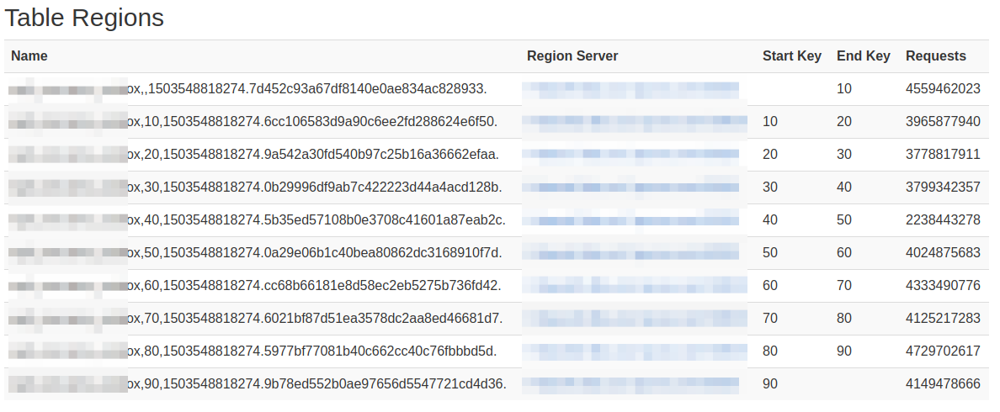
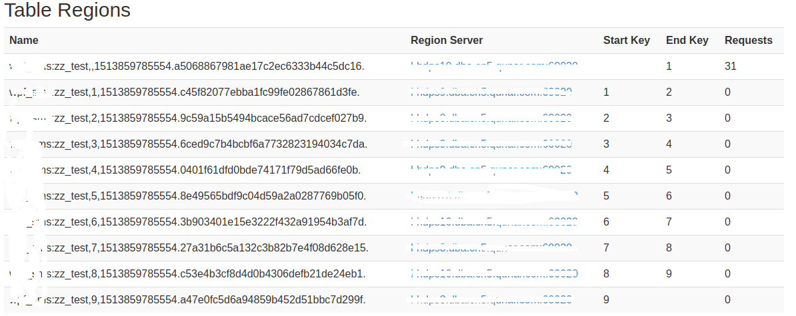
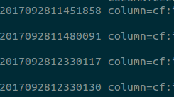

### 1. Region的rowkey范围是开区间还是闭区间？
答：region的rowkey是前闭后开(`[start,end)`)，从下面这张图可以看出来：



Tip：Name列都是以`Start Key`开始，但不是以`End Key`结尾，而是一串很长的数字，可以想象，应该是无限接近`End Key`的！

再看下面这个：预分区10个，以一位作为分区标记（`hash%10`），插入一条数据，且row是0开头，可以看出仅第一个region有31次请求！
建表语句：`create 'xx:xxx',{SPLITS => ['1','2','3','4','5','6','7','8','9']},{NAME => 'c', COMPRESSION=>'SNAPPY', VERSIONS => 1}`，



再次证明region区间是前闭后开！

### 2. Scan的rowkey范围是开区间还是闭区间？
答：scan是前闭后开，[startKey,endKey),如我们做分页的时候通常会拿前一页的最后一行数据的row，并在该row上面加一个byte，以跳过本行，实现快速分页查询的效果！
以上只证明了是前闭，前闭后开可以在shell中证明：`scan 'xxx', {STARTROW=>'qb_car_pc2017092811451858', STOPROW=>'qb_car_pc2017092812330135'}`执行结果：



Tip：这条语句中的`STARTROW`和`STOPROW`是两个相邻的Row，从结果中可以看出查询中包含了`STARTROW`，但是结尾是小于`STOPROW`的row。

### 3. HTablePool线程安全么？如果线程安全，为什么？如果线程不安全，有什么影响？
答：HTablePool好像官方提供了后又删了，不过有人实现了个类似HTablePool的连接池。
谈线程安全，我想应该是谈HTable，Htable是一个非线程安全的方法，每次操作都需要重新new一个HTable实例，频繁的创建性能开销也不大，
其底层是使用一个线程池来与Hbase service做交互！
但是高qps下，还是可以做一个HTable的对象池，（。。。）我这里基于`0.98.6-hadoop2`版的client实现了一个HTable的线程池！
如果多线程下使用同一个HTable实例，最直观的结果是数据不完整或丢失（- -我这里踩过一个大坑），这个好像跟Htable在本地的cache相关！
### 4. 根据row的查询方法：Regex，Substring，Prefix，Rang查询怎样
答：结论：`Rang >= Prefix > Substring >=Regex`，上述结论基于约12亿数据，8个RS，预分区10个，每个100G，版本`HBase client 0.96`下统计；
row格式如下：`xx + 20171108 + mobile + onlyBunch`，相同条件下scan的范围查询和前缀查询效率相当，正则和sustring的方式查询非常慢，基本不可用。
**所以**，数据了较大的情况下，row的设计最多能包含两个条件（一般是`xxId+时间`），更多条件推荐新建一张保存原表rowKey的HBase索引表。
**也即**，类似`UserId + Mobile + 时间戳`的rowkey设计是不可取的！
**另外**，查询效率差别原因：rang和prefix可以通过前缀确定一个比较小的范围，而substring 和regex则是全表扫描row，在加上字符串匹配，所以效率会非常低！

### 5. Filter的实现原理
答：所有的Filter都是基于`Filter`和`FilterBase`的，自定义一个Filter，需要将其编译成jar包，然后放到集群上然后重启集群。
其中最重要的两个需要实现的方法就是：`boolean filterRowKey(byte[] buffer, int offset, int length)`
和`ReturnCode filterKeyValue(Cell ignored)`，前者决定是否过滤掉这个rowkey，后者决定列的问题：`INCLUDE,INCLUDE_AND_NEXT_COL,SKIP,...`等等。
Filter是在RegionServer上中读取数据时使用，将过滤操作放到RS上可以减少网络开销，每次scan，其携带的每个Filter都会在每个RegionServer上实例化一个，并按照Filter加入List的顺序执行。
Tip：详情可参考《HBase实战》中的4.8节，关于过滤数据的阐述。

### 6. scan中的setCaching与setBatch方法的区别是什么呢？
setCaching设置的值为每次rpc的请求记录数，默认是1；cache大可以优化性能，但是太大了会花费很长的时间进行一次传输。
setBatch设置每次取的column size；有些row特别大，所以需要分开传给client，就是一次传一个row的几个column。
batch和caching和hbase table column size共同决意了rpc的次数。
https://docs.transwarp.io/4.7/goto?file=HyperbaseManual_hbase-architecture-chapter.html#hbase-architecture-chapter
http://blog.csdn.net/lin_wj1995/article/details/72967494

### 7. ResultScanner的机制
答：首先与HBase相关的默认参数都在`org.apache.hadoop.hbase.HConstants`中定义，
表相关的参数在`org.apache.hadoop.hbase.client.TableConfiguration`中设置，TableConfiguration中有两个参数：`scannerCaching`和`scannerMaxResultSize`
默认是：`scannerCaching=100`，`scannerMaxResultSize=2097152L`。
看ResultScanner的实现：`org.apache.hadoop.hbase.client.ClientScanner#next`
```
    public Result next() throws IOException {
      // If the scanner is closed and there's nothing left in the cache, next is a no-op.
      if (cache.size() == 0 && this.closed) {
        return null;
      }
      if (cache.size() == 0) {
        // Contact the servers to load more Results in the cache.
        loadCache();
      }

      if (cache.size() > 0) {
        //取出数据
        return cache.poll();
      }

      // if we exhausted this scanner before calling close, write out the scan metrics
      writeScanMetrics();
      return null;
    }
```
这里，应该是很明了了，ResultScanner并不是一次把所有符合查询条件的数据都加载到client，而是每次取一部分。

### 8. 如何找到region的
答：HBase中有两个特殊的表`-ROOT-`表和`.META.`表，`-ROOT-`表永远只有一个region，`.META.`表可以切分成多个region。他们都保存在RegionServer上。
`-ROOT-`表保存了`.META.`表的位置，`.META.`表保存了每个region所在的位置。
设`-ROOT-`表内容如下：
```
M:1001 - M:1009 M1 RS1
M:1010 - M:1019 M1 RS2
```
`-ROOT-`告诉client，scan的rowkey范围`1001~1009`的region可以在RS1的`.META.`表中找到，同理`10010~1019`.
设RS1的`.META.`表内容如下：
```
T:1001 - T:1005 R1 RS1
T:1006 - T:1009 R2 RS2
```
`.META.`表告诉client，rowkey范围在`1001～1005`之间的可以在RS1的R1 region中查找到。
注：`-ROOT- 和 .META.`的region也不例外，保存的row范围是前闭后开!上面例子只是一个表述。
总结，查找过程：`client ==> -ROOT- ==> .META. ==> region`,首次查询client会去Zookeeper中拿到`-ROOT-`表信息，随后client会缓存`-ROOT-`表和`.META.`表信息。

