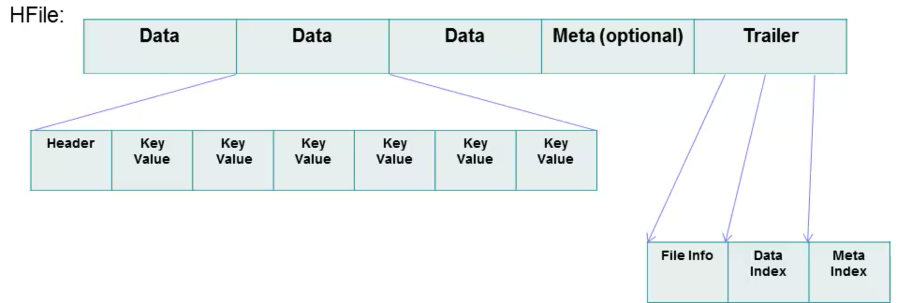

**前言：** copy整理的一些东西，部分参考HBase实战和HBase权威指南。

# HBase基础知识整理
- Hbase是一个高可靠性、高性能、面向列、可伸缩的分布式存储系统，Zookeeper + Master+Region Server + HLog保证高可靠，面向列的存储提供了高性能（通常写入性能要好，读要差点，虽然号称有百万吞吐量每秒）.
- Region的自动分裂机制保证了系统的可伸缩性。当一台服务down掉，可以自动恢复（HLOG恢复数据），这保证了其可靠性。
- Hbase无法使用sql，但是可以联合Phonenix或 Hive，但是会有一定的性能损失，联合hive就无法绕过MapReduce，Phonenix性能优于hive但是会部分改变Hbase原有数据组织。

缺点：不支持二级索引(如果要实现二级索引可以通过建立索引表的形式,二级索引无非就是将scan查询改为get查询!)，不支持事务

## 1，Hbase组件介绍
1. `Master`：HBase Master 用于协调多个 Region Server，侦测各个 Region Server 之间的状态，并平衡 Region Server 之间的负载。
HBase Master 还有一个职责就是负责分配 Region 给 Region Server。HBase 允许多个 Master 节点共存，但是这需要 Zookeeper 的帮助。
不过当多个 Master 节点共存时，只有一个 Master 是提供服务的，其他的 Master 节点处于待命的状态。当正在工作的 Master 节点宕机时，其他的 Master 则会接管 HBase 的集群。
2. `Region Server`：一个Region Server管理多个Region。Region Server的作用只是管理表格，以及实现读写操作。Client 直接连接 Region Server，并通信获取 HBase 中的数据。
Region是真实存放 HBase 数据的地方，也就说 Region 是 HBase 可用性和分布式的基本单位，也是HBase高并发的基础。
如果当一个表格很大，并由多个 CF 组成时，那么表的数据将存放在多个 Region 之间，并且在每个 Region 中会关联多个存储的单元（Store）。
一个Region对应一个CF，一个CF可以有多个Region（按Rowkey区间进行分裂，且当Region数据达到上限就会自动分裂成多个Region）
3. `Region`：每个Region用于保存一个CF中的某一段（rowkey范围划分）数据，Region的自动分裂实现了类似的水平分表。
开始一张表的Region可能保存在同一个Region Server中，随着Region分裂变多，同一张表的Region可能会被分配到不同的Region Server中。
4. `MemStore,Store,StoreFile`关系：Stroe可以理解成一个Region的数据仓库（是一个虚拟概念），一个Region下可能有多个Stroe（也有多个MemStroe，因为一个store对应一个MemStroe，一个cf对应一个Stroe），一个Stroe下有多个StoreFile。
MemStore满后会刷到磁盘对应生产一个新的StoreFile，当多次MemStore刷写到磁盘后StoreFile会变多，最后多个小的StoreFile会合并成一个大的StroeFile（即：compact合并操作）。
一个store对应一个MemStore，一个Store下有多个StoreFile，一个StoreFile对应一个HFile，HFile最后都保存在HDFS中。
StoreFile和HFile的关系可以看做相等，HFile只是在StroeFile上面做了一层封装。
> HBase为了方便按照RowKey进行检索，要求HFile中数据都按照RowKey进行排序，Memstore数据在flush为HFile之前会进行一次排序，将数据有序化；

但是,多个StroeFile之间是有序的吗？
这里，通过询问HBase大神，得知的结果是：多个StroeFile之间是无序的！

3. `HLog`：HLog是一个实现Write Ahead Log（WAL）的类，用户的每次修改操作都会先写入到HLog保存到物理存储，
当Region Server意外终止后，Master会通过Zookeeper感知，Master会根据HLog文件，恢复Region Server中未持久化到HFile中的数据！从而保证**数据写入的可靠性**

Tip：每个Region Server中都会有一个HLog的实例，Region Server会将更新操作（如 Put，Delete）先记录到WAL（也就是 HLog）中，
然后再将操作写入到MemStore，MemStore到达配置的内存阀值后会将数据写入到持久化的HFile中。
这样就保证了HBase的写的可靠性。如果没有WAL，当Region Server宕掉的时候，MemStore还没有写入到HFile，或者StoreFile 还没有保存，数据就会丢失。

3. `Zookeeper`：首先Zookeeper是作为HBase Master的HA解决方案。也就是说，是Zookeeper保证了至少有一个HBase Master处于运行状态。
并且Zookeeper负责Region和Region Server的注册。
4. `HDFS`：虽然HBase也可以存储在本地文件系统，通常使用HDFS作为底层存储，HDFS保证了分布式文件系统的数据可靠性（一般每份数据有3个copy）。

## 2，Hbase工作原理流程
综上所述，来张图，并讲述一下Hbase的工作流程：

### 写工作流程：
当一个Client访问HBase集群时，Client需要先和Zookeeper来通信，找到对应的Region Server，一个Region Server管理着很多个Region。
Client写入 -> 存入内存MemStore，一直到MemStore满 -> Flush成一个新StoreFile，
StoreFile增长到一定阈值 -> 触发Compact合并操作 -> 多个StoreFile合并成一个StoreFile，同时进行版本合并和数据删除。
当StoreFiles Compact后，逐步形成越来越大的StoreFile -> 单个StoreFile大小超过一定阈值后，触发Split操作
把当前Region Split成2个Region（可以简单理解成：从中间切开，100G从中间切成2个50G），原Region会下线，新Split出的2个孩子Region会被HMaster分配到相应的HRegionServer上（自动rebalance），使得原先1个Region的压力得以分流到2个Region上。
由此过程可知，HBase只是增加数据，有所得更新和删除操作，都是在Compact阶段做的，所以，用户写操作只需要进入到内存即可立即返回，从而保证I/O高性能。

**Tip：**HBase的删除操作不是真正的物理删除，因为HFile文件是不可变的，只是在相应记录上做一个标记，使得scan/get不返回该记录，真正的物理删除实在合并压缩阶段！
**Tip：**HBase是行锁，也即修改一行中的多个数据时要么都成功，要么都失败！
**关于切分点：**
> 切分点为，整个region中最大store中的最大文件中最中心的一个block的首个rowkey
> 另外，HBase还规定，如果定位到的rowkey是整个文件的首个rowkey或者最后一个rowkey的话，就认为没有切分点。
> 什么情况下会出现没有切分点的场景呢？
> 最常见的就是一个文件只有一个block，执行split的时候就会发现无法切分。很多在测试split的时候都是往新表中插入几条数据并执行一下flush，再执行split，却发现> 数据表并没有真正执行切分。

### 读工作流程：
连接过程和写相同，不同的是，读通过缓存来读取记录，使用LRU算法将HFile中热点数据缓存到内存，另外从HFile中读取一行，还要检查MemStore中未持久化到HFile的数据是否有该行的修改记录！

## 3，HFile文件格式
HFile数据组织形式：

一个HFile中有多个Data数据块，数据块中有一个header和多个k-v组成，默认64KB，HFile文件尾部有一个Trailer，其中包含数据相关的索引信息，Hbase也是通过Trailer的索引来检索数据。有没有发现，这样的组织非常类似B树！

## 4，Hbase一些术语理解
1. `Row Key`:按照字典顺序排序，最多只能存储64k的字节数据。通俗理解，用作数据分块的依据。比如：`row设置为20170505`，表示将数据按天切分开！
2. `Column Family列族（CF1、CF2、CF3） & qualifier列`：
数据存储，权限控制，条优都是通过CF来进行的，通常单表不要超过3个CF（一般建一个CF，且名字尽可能短），一个CF下可以有多个`column`（k-v，最小数据单元），且可以动态扩展。
通常CF下面还可以有多个Qualifier，可以理解为Family是第一级列，Qualifier是第二级列。
3. `Cell单元格`：由时间戳来作为版本，无数据类型，以字节码形式存储。由{row key，column(=<family> +<qualifier>)，version}唯一确定的单元。

### 高表和宽表
通常倾向于设计成高表，形象的理解如下:
宽表:
| x | c1  | c2  |  c3 |
| ---- |:-----:| ---:|
| r1 | x  | x | x |
高表:
|  x | r1 |
| ---- |:-----:|
| c1  |  x |
| c2  |  x |
| c3  |  x |

高表优点：HBase只能按行进行分片，高表更灵活；根据HBase的拆分规则，高表更容易拆分。
**Tip：**Region数据到达设置的大小时，会自动split（分裂），split成多个小的Region，此过程中还需要对StoreFile进行分割和压缩（compact）形成对应Region下的独立StroeFile。另外，大的Region StoreFile也会更大，所以大的StroeFile分裂压缩操作也是对内存的一个挑战！
宽表优点：HBase保证了行级的原子性，宽表的更新操作更方便，反观高表，可能需要跨行更新。

