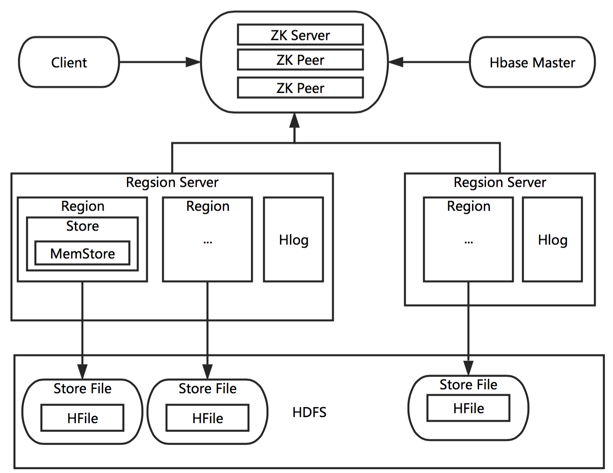
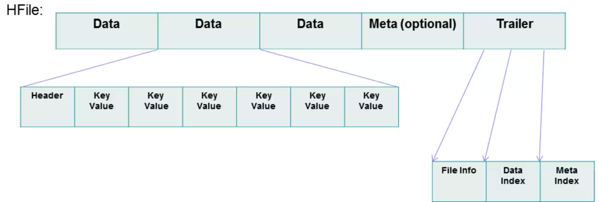
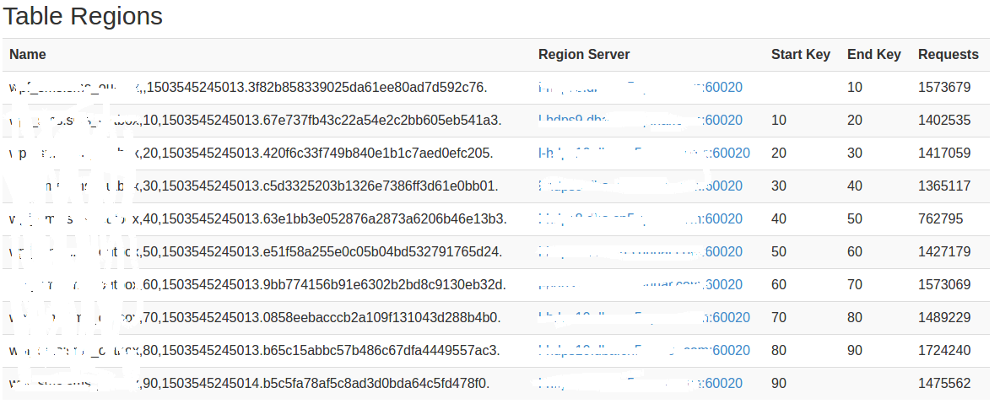

**前言：**一次HBase的rowkey设计，走了些弯路，踩了些坑，故这里记录下来，供参考引以为戒吧。在介绍rowkey设计之前，必须对HBase有个最基本的了解，本文先介绍关于HBase的基础知识，再根据简化场景介绍rowkey设计的演化过程。

# 一. HBase基础知识整理
- Hbase是一个高可靠性、高性能、面向列、可伸缩的分布式存储系统，Zookeeper + Master+Region Server + HLog保证高可靠，面向列的存储提供了高性能（通常写入性能要好，读要差点，虽然号称有百万吞吐量每秒）.
- Region的自动分裂机制保证了系统的可伸缩性。当一台服务down掉，可以自动恢复（HLOG恢复数据），这保证了其可靠性。
- Hbase无法使用sql，但是可以联合Phonenix或 Hive，但是会有一定的性能损失，联合hive就无法绕过MapReduce，Phonenix性能优于hive但是会部分改变Hbase原有数据组织。

缺点：不支持二级索引(如果要实现二级索引可以通过建立索引表的形式,二级索引无非就是将scan查询改为get查询!)，不支持事务

## 1，Hbase组件介绍
1. `Master`：HBase Master 用于协调多个 Region Server，侦测各个 Region Server 之间的状态，并平衡 Region Server 之间的负载。
HBase Master 还有一个职责就是负责分配 Region 给 Region Server。HBase 允许多个 Master 节点共存，但是这需要 Zookeeper 的帮助。
不过当多个 Master 节点共存时，只有一个 Master 是提供服务的，其他的 Master 节点处于待命的状态。当正在工作的 Master 节点宕机时，其他的 Master 则会接管 HBase 的集群。
2. `Region Server`：一个Region Server管理多个Region。Region Server的作用只是管理表格，以及实现读写操作。Client 直接连接 Region Server，并通信获取 HBase 中的数据。
Region是真实存放 HBase 数据的地方，也就说 Region 是 HBase 可用性和分布式的基本单位，也是HBase高并发的基础。
如果当一个表格很大，并由多个 CF 组成时，那么表的数据将存放在多个 Region 之间，并且在每个 Region 中会关联多个存储的单元（Store）。
一个Region对应一个CF，一个CF可以有多个Region（按Rowkey区间进行分裂，且当Region数据达到上限就会自动分裂成多个Region）
3. `Region`：每个Region用于保存一个CF中的某一段（rowkey范围划分）数据，Region的自动分裂实现了类似的水平分表。
开始一张表的Region可能保存在同一个Region Server中，随着Region分裂变多，同一张表的Region可能会被分配到不同的Region Server中。
4. `MemStore,Store,StoreFile`关系：Stroe可以理解成一个Region的数据仓库（是一个虚拟概念），一个Region下可能有多个Stroe（也有多个MemStroe，因为一个store对应一个MemStroe，一个cf对应一个Stroe），一个Stroe下有多个StoreFile。
MemStore满后会刷到磁盘对应生产一个新的StoreFile，当多次MemStore刷写到磁盘后StoreFile会变多，最后多个小的StoreFile会合并成一个大的StroeFile（即：compact合并操作）。
一个store对应一个MemStore，一个Store下有多个StoreFile，一个StoreFile对应一个HFile，HFile最后都保存在HDFS中。
StoreFile和HFile的关系可以看做相等，HFile只是在StroeFile上面做了一层封装。
> HBase为了方便按照RowKey进行检索，要求HFile中数据都按照RowKey进行排序，Memstore数据在flush为HFile之前会进行一次排序，将数据有序化；

但是,多个StroeFile之间是有序的吗？
这里，通过询问HBase大神，得知的结果是：多个StroeFile之间是无序的！

3. `HLog`：HLog是一个实现Write Ahead Log（WAL）的类，用户的每次修改操作都会先写入到HLog保存到物理存储，
当Region Server意外终止后，Master会通过Zookeeper感知，Master会根据HLog文件，恢复Region Server中未持久化到HFile中的数据！从而保证**数据写入的可靠性**

Tip：每个Region Server中都会有一个HLog的实例，Region Server会将更新操作（如 Put，Delete）先记录到WAL（也就是 HLog）中，
然后再将操作写入到MemStore，MemStore到达配置的内存阀值后会将数据写入到持久化的HFile中。
这样就保证了HBase的写的可靠性。如果没有WAL，当Region Server宕掉的时候，MemStore还没有写入到HFile，或者StoreFile 还没有保存，数据就会丢失。

3. `Zookeeper`：首先Zookeeper是作为HBase Master的HA解决方案。也就是说，是Zookeeper保证了至少有一个HBase Master处于运行状态。
并且Zookeeper负责Region和Region Server的注册。
4. `HDFS`：虽然HBase也可以存储在本地文件系统，通常使用HDFS作为底层存储，HDFS保证了分布式文件系统的数据可靠性（一般每份数据有3个copy）。

## 2，Hbase工作原理流程
综上所述，来张图，并讲述一下Hbase的工作流程：



### 写工作流程：
当一个Client访问HBase集群时，Client需要先和Zookeeper来通信，找到对应的Region Server，一个Region Server管理着很多个Region。
Client写入 -> 存入内存MemStore，一直到MemStore满 -> Flush成一个新StoreFile，
StoreFile增长到一定阈值 -> 触发Compact合并操作 -> 多个StoreFile合并成一个StoreFile，同时进行版本合并和数据删除。
当StoreFiles Compact后，逐步形成越来越大的StoreFile -> 单个StoreFile大小超过一定阈值后，触发Split操作
把当前Region Split成2个Region（可以简单理解成：从中间切开，100G从中间切成2个50G），原Region会下线，新Split出的2个孩子Region会被HMaster分配到相应的HRegionServer上（自动rebalance），使得原先1个Region的压力得以分流到2个Region上。
由此过程可知，HBase只是增加数据，有所得更新和删除操作，都是在Compact阶段做的，所以，用户写操作只需要进入到内存即可立即返回，从而保证I/O高性能。

**Tip：**HBase的删除操作不是真正的物理删除，因为HFile文件是不可变的，只是在相应记录上做一个标记，使得scan/get不返回该记录，真正的物理删除实在合并压缩阶段！
**Tip：**HBase是行锁，也即修改一行中的多个数据时要么都成功，要么都失败！
**关于切分点：**
> 切分点为，整个region中最大store中的最大文件中最中心的一个block的首个rowkey
> 另外，HBase还规定，如果定位到的rowkey是整个文件的首个rowkey或者最后一个rowkey的话，就认为没有切分点。
> 什么情况下会出现没有切分点的场景呢？
> 最常见的就是一个文件只有一个block，执行split的时候就会发现无法切分。很多在测试split的时候都是往新表中插入几条数据并执行一下flush，再执行split，却发现> 数据表并没有真正执行切分。

### 读工作流程：
连接过程和写相同，不同的是，读通过缓存来读取记录，使用LRU算法将HFile中热点数据缓存到内存，另外从HFile中读取一行，还要检查MemStore中未持久化到HFile的数据是否有该行的修改记录！

## 3，HFile文件格式
HFile数据组织形式：


一个HFile中有多个Data数据块，数据块中有一个header和多个k-v组成，默认64KB，HFile文件尾部有一个Trailer，其中包含数据相关的索引信息，Hbase也是通过Trailer的索引来检索数据。有没有发现，这样的组织非常类似B树！

## 4，Hbase一些术语理解
1. `Row Key`:按照字典顺序排序，最多只能存储64k的字节数据。通俗理解，用作数据分块的依据。比如：`row设置为20170505`，表示将数据按天切分开！
2. `Column Family列族（CF1、CF2、CF3） & qualifier列`：
数据存储，权限控制，条优都是通过CF来进行的，通常单表不要超过3个CF（一般建一个CF，且名字尽可能短），一个CF下可以有多个`column`（k-v，最小数据单元），且可以动态扩展。
通常CF下面还可以有多个Qualifier，可以理解为Family是第一级列，Qualifier是第二级列。
3. `Cell单元格`：由时间戳来作为版本，无数据类型，以字节码形式存储。由{row key，column(=<family> +<qualifier>)，version}唯一确定的单元。

### 高表和宽表
通常倾向于设计成高表，形象的理解如下:
宽表:
| x | c1  | c2  |  c3 |
| ---- |:-----:| ---:|
| r1 | x  | x | x |
高表:
|  x | r1 |
| ---- |:-----:|
| c1  |  x |
| c2  |  x |
| c3  |  x |

高表优点：HBase只能按行进行分片，高表更灵活；根据HBase的拆分规则，高表更容易拆分。
**Tip：**Region数据到达设置的大小时，会自动split（分裂），split成多个小的Region，此过程中还需要对StoreFile进行分割和压缩（compact）形成对应Region下的独立StroeFile。另外，大的Region StoreFile也会更大，所以大的StroeFile分裂压缩操作也是对内存的一个挑战！
宽表优点：HBase保证了行级的原子性，宽表的更新操作更方便，反观高表，可能需要跨行更新。

- - -

# 三. 设计Rowkey演化

## 1，rowkey设计原则
1. 全局唯一，hbase以此为索引检索数据，一个rowkey对应一行数据！
2. 以字典顺序排序，最大64k，存为byte[]字节数组，尽可能短（若rowkey=100byte，1000w行，就要占近1G空间）！一般设计在`10-100`byte之间,一个ASCII字符,占1byte！
**字典顺序,也可以理解成ASCII表的顺序,比如:数字+字母组合,范围可以是`0-z`**
3. 将经常读或最近可能被访问的数据放到一起！而且要保证数据均匀分布到不同的Region中。
且要防止热点问题，如果热点数据都放在一个Region中，多个client访问同一个Region，造成单台服务器压力太大，出现热点问题，性能不佳！
4. rowkey的高位设计成离散的。
如果将时间戳放在rowkey的高位，会导致所有数据都集中在一个Region，造成热点问题。如：201707218613512345678abcd，这种rowkey就会出现热点问题！每天所有数据都会写入同一个region
5. 一个rowkey对应二维表中的一行(可以看做唯一键)

Tip：所说的**高位**表示一串字符串，从左到右等价于从高位到低位。

## 2，rowkey设计策略
1. `Salt`，即在rowkey高位加几位随机数，随机数的种类和你预期使用的Region数量保持一致。
2. `Hash`，为使高为离散，使用Hash值放在高位。
3. `reverse`，即反转字符串序列，通常高位是不变的（如2017），反转后经常改变的部分放在前面了，rowkey离散了，但是rowkey会变得无序！
常见反转例子：
(1) 手机号反转：相比手机号的固定开头，发转后会使得数据更加离散。
(2) 时间戳反转：可以设计成key+ (Long.Max_Value - timestamp)的格式rowkey，这样最近的数据值最小，scan (key) 获取的是最新是数据，保证了升序。
且范围查询比较方便，如startRow:(Long.Max_Value - 起始时间)，stopRow:(Long.Max_Value - 结束时间)

## 3，多种rowkey设计分析
场景：HBase保存所有发送的message记录，每条短信包括手机号，发送时间，内容，是否到达... ...等等，供其他业务线查询，从用户角度出发最基础的查询message条件是：手机号+大概时间。
假设message数量在十的10次方级别，qps在1w左右，保存一条message内容需要3次左右的put操作，其中的两次需要get查询一次message并有check逻辑。
设计一个rowkey，既能满足基本的查询要求，还能抗住读写压力。
根据上面的背景介绍，rowkey的设计必须至少包含时间，手机号两个因素，下面谈谈我的一步步演化的设计思路：
1. rowkey = [dateTime] + [mobile] + [reverse timestamp]，如：2017071386136123498761503382954
这样设计，好处在于同一天的数据会放在同一块（往往都会查最近一天的某个手机号的N条记录），可以统计每天的数据量。坏处是热点问题，如果读写qps太可能会出现问题。
这种，设计是不合理的，缺点很多，而且可做到上述要求的方法很多，这后面再分析。
2. rowkey = [mobile reverse] + [reverse timestamp]
这样，既没有热点问题，也能进行范围查询，比较方便和推荐的设计，根据，但是要统计某段时间内的数据就比较麻烦，需要全表rowkey字符串比对，如果希望快速统计可以使用索引表来解决，即将日期时间放到高位上。
3. rowkey = [hash dataTime] + [mobile] + [reverse timestamp]
这样可以通过前面的Hash方法确定指定Region的个数，也能方便地统计和查询，但是还是会有热点问题。
说到这里，只描述了最简单的查询场景下的rowkey的探索，鱼和熊掌不能兼得，想要没有热点问题（或者说支持更高的读写并发），那就必须得将数据离散开，这样范围统计就变得困难！反之，亦然。
4. rowkey = [hash mobile%10] + [date time] + [mobile] +[reverse timestamp]
这是最终方案，也算一个折中，采用`预分区+Hash散列`，既能避免热点问题，也可以在可控范围内进行数据统计（范围统计），后面详细描述。

有个问题：如果我将每个Region设置为10G，这样开始可能数据在一个Region中，但是随着数据量变大，10GRegion填满，发生Split，那么一个Region就均分成两个小范围的StartRowkey和StopRowkey了，这样读写压力不就分到多个RegionServer中了吗？
答：看似很有道理，首先split是根据文件大小大概从中间一分为二，另外多数业务场景想Rowkey是递增的，即数据通常是有序存入storeFile中的，也就是说写最终还是只会在一个Region上写，并不能解决热点问题！

好吧，上面都是瞎DIY，下面提出一种能够满足三个条件组合查询，并能实时统计功能的rowkey设计：
数据表rowkey设计：`reverse mobile`（定长）+ `reverse timestamp`(19) + 唯一串(可不要)
索引表rowkey设计：`x` + `20171212` + `md5 account`(定长16) + `mobile`（定长处理） + `reverse time` （仅时间反转定长9） + 唯一串(可不要)
建表时采用预分区：
数据表，手机号前两位作为预分区（20个）：
```
SPLITS => ['05','10','15','20','25','30','35','40','45','50','55','60','65','70','75','80','85','90','95']
```
索引表将x作为预分区（x是 `hash mobile % 10 == 10`个）：`SPLITS => ['1','2','3','4','5','6','7','8','9']`

### 另一个可以参考的方案：预分区+Hash散列

方案叙述：**`rowkey = [hash mobile] + [date time] + [mobile] +[reverse timestamp]`**
1. 预分区：表示在创建表的时候指定Region个数或范围。
指定Region个数的语法：
`create 'namespace:table_name', {NUMREGIONS => 5, SPLITALGO => 'HexStringSplit'}, {NAME => 'cf', COMPRESSION=>'SNAPPY', VERSIONS => 1}`
建表时会创建5个分区，但是分区的rowkey范围会根据rowkey动态决定。
指定Region个数和Region范围：
`create 'namespace:table_name',{SPLITS => ['10', '20', '30', '40', '50', '60', '70','80','90']},{NAME => 'cf', COMPRESSION=>'SNAPPY', VERSIONS => 1}`
创建表时指定创建10个分区，范围从`0~10`，`10~20`，...，`90~`十个预分区，此时就需要Hash散列，在rowkey前两位随机产生0~100的随机数。

2. Hash散列：表示根据rowkey中某个字段Hash出一个范围数字，作为rowkey的高位，这样这个散列可以重现，使得我们能通过rowkey进行get查询，也可以进行范围查询。
Hash出来的数字是可以根据rowkey中某个字段重新计算出来的，如果要随机产生0~100的随机数最简单与100取余即可，但实际应用中可能需要进行数据抽样分析，确保能均匀分散到每一块。如，Hash Mobile可以直接取mobile后两位作为rowkey的高位，也可以先获求一个mobile的Hash值，再与100取余。
另外，如果服务器RegionServer只有5个，那么预分区设置成5个或许会更好。
这里给出，测试约1500w数据的写入结果：


数据能够均匀分布在不同的RS上。其中，前两位是取mobile的最后一位和一个随机数（这里选择的是区间中间值5）包括（05,15,25,35,45,55,65,75,85,95）等10种情况。当然，这里取一位也可以，但是这里考虑到其他情况所以选择两位，可能还有其他很好方法具体情况就具体分析了。

有个问题：如果具体业务中历史数据随着时间的推移使用和查询几率越来越小，会不会因为历史数据和最新数据混合在一起导致查询效率的降低？
答：不会！首先rowkey的设计一般会根据时间递增或递减，所以在Region中数据会按照时间排列在一起，最新的数据始终会在最前或最后，rowkey的范围查询，并不会遍历到历史数据！

最后，在实际的情景中，可能由于各种问题，得有些折中。这里不是为了做抛砖引玉的作用，仅作引以为界罢了。

