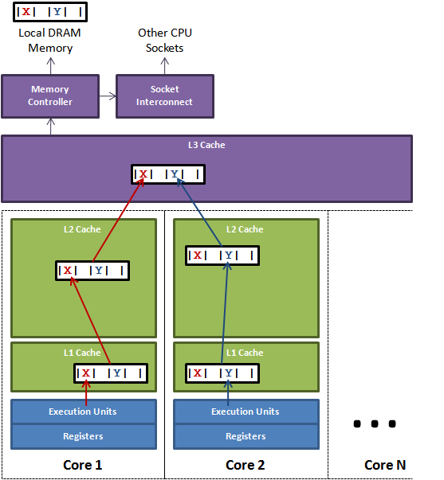

**前言：**最近看了很多关于volatile和synchronized的博客，很多说法理解不一，故此，这里整理我对于这两个关键字的理解。

## 基础介绍
Java 关键字`volatile`可以让变量的修改在多个线程之间可见，即cpu核心1对`volatile`修饰的变量进行修改会立即刷新该变量在RAM中的值！同时，使所有包含该变量的缓存行失效。
这里，还一种说法是，volatile修饰的变量不会被缓存，读写直接在RAM中进行，我认为是错误的理解！


### 1. 伪共享 or 缓存一致性协议
当多线程修改互相独立的变量时，如果这些变量共享同一个缓存行，即被放到同一个缓存行中，如果其中一个核心1修改了其中一个变量A，那么另一个有相同缓存行的核心2的缓存会失效需要重新加载缓存，即使变量A的修改不影响核心2的正确执行，这就导致了性能损失，这就是伪共享。也称作:缓存一致性协议!



一致协议的两种实现（copy自network）：
1. 一种实现：（一种早期奔腾处理器上的实现）
一种处理一致性问题的办法是使用Bus Locking（总线锁）。当一个CPU对其缓存中的数据进行操作的时候，往总线中发送一个Lock信号。
这时，所有CPU收到这个信号之后就不操作自己**对应**缓存行中的**对应**数据了，当操作结束，释放锁以后，所有的CPU就去内存中获取最新d **对应**数据更新缓存行。
但是用锁的方式总是避不开性能问题。总线锁总是会导致CPU的性能下降，总线锁住期间其他CPU可能都会等待总线资源。所以出现另外一种维护CPU缓存一致性的方式，MESI。

2. 另一种实现:（是第一种实现的改进）
MESI是保持一致性的协议。它的方法是在CPU缓存中保存一个标记位，这个标记位有四种状态:
M: `Modify`，修改缓存，当前CPU的缓存已经被修改了，即与内存中数据已经不一致了
E: `Exclusive`，独占缓存，当前CPU的缓存和内存中数据保持一致，而且其他处理器并没有可使用的缓存数据
S: `Share`，共享缓存，和内存保持一致的一份拷贝，多组缓存可以同时拥有针对同一内存地址的共享缓存段
I: `Invalid`，实效缓存，这个说明CPU中的缓存已经不能使用了

CPU的读取遵循下面几点：
如果缓存状态是I，那么就从内存中读取，否则就从缓存中直接读取。
如果缓存处于M或E的CPU读取到其他CPU有读操作，就把自己的缓存写入到内存中，并将自己的状态设置为S。
只有缓存状态是M或E的时候，CPU才可以修改缓存中的数据，修改后，缓存状态变为M。
这样，每个CPU都遵循上面的方式则CPU的效率就提高上来了。

摘抄：
> intel的手册对lock前缀的说明如下：
> 1. 确保对内存的读-改-写操作原子执行。在Pentium及Pentium之前的处理器中，带有lock前缀的指令在执行期间会锁住总线，使得其他处理器暂时无法通过总线访问内存。很显然，这会带来昂贵的开销。从Pentium 4，Intel Xeon及P6处理器开始，intel在原有总线锁的基础上做了一个很有意义的优化：如果要访问的内存区域（area of memory）在lock前缀指令执行期间已经在处理器内部的缓存中被锁定（即包含该内存区域的缓存行当前处于独占或以修改状态），并且该内存区域被完全包含在单个缓存行（cache line）中，那么处理器将直接执行该指令。由于在指令执行期间该缓存行会一直被锁定，其它处理器无法读/写该指令要访问的内存区域，因此能保证指令执行的原子性。这个操作过程叫做缓存锁定（cache locking），缓存锁定将大大降低lock前缀指令的执行开销，但是当多处理器之间的竞争程度很高或者指令访问的内存地址未对齐时，仍然会锁住总线。
2. 禁止该指令与之前和之后的读和写指令重排序。
3. 把写缓冲区中的所有数据刷新到内存中。

### 2. 重排序
1. 指令重排序
cpu会对互相不影响的指令进行重排序，以提升性能，也即代码执行的顺序可能和我们写的不一样！
2. JVM重排序
JVM会对对象中的变量进行排序，因为对象的起始地址以8字节对齐，所以字段顺序会以`double/long，int/float，short/char，bool/byte，引用，子类字段`重新组织。
3. 内存屏障
为了阻止cpu对指令的重排序，可以采用`内存屏障`（一组处理器指令）阻止指令重排。

## 3. happens-before（先行发送原则）
Java内存模型(JMM, Java Memory Model)为保证可见性原则定义了happens-before规则，一句通俗的话解释：
> 两个操作间具有happens-before关系，并不意味着前一个操作必须要在后一个操作之前执行。happens-before仅仅要求前一个操作对后一个操作可见。
更具体的解释可以参考：《深入理解Java虚拟机》12.3.6节对happens-before的阐释。
JMM定义的happens-before原则保证了多线程下变量的立即可见性：
A线程执行i=1；B线程执行j=i，只要A在B之前执行（即符合happens-before原则）那么必然j=1！

## volatile
1. 任何线程对volatile变量的修改会对其他缓存该变量的线程立即可以见！强制刷新缓存到主内存！
2. JVM会在volatile变量处插入一个内存屏障，防止指令重拍序！
3. 某个线程对volatile的修改，会导致其他cpu高速缓存中对应该变量的缓存行失效（CPU的L1或者L2缓存中对应的缓存行无效，即缓存一致性协议）！
4. **volatile只能保证变量对各个线程的可见性，但不能保证原子性**，因为对一个变量的修改包括读取变量值，修改值，刷入主内存！
三步完成，如果线程1读取到值后，线程2对变量值进行修改且刷入主内存，这时线程继续修改，并刷入主内存，显然会出现错误，这三步操作就不具有原子性！

volatile使用场景：
1. 状态标记，方法只被执行一次，如spring的refresh事件中首次启动执行某个任务一次！
2. 双重检验锁，单利模式。
3. `ConcurrentHashMap`中很大遍历都采用volatile修饰，如：Node的value和next指针都是volatile；数组槽，成员变量等。
4. `Atomic`系列的类中值都用volatile修饰，以便`compareAndSet`时候拿到的是最新的值。

## 一个你可能没有考虑过的常用场景
```
private ReentrantLock lock = new ReentrantLock();
private int count = 0;
lock.lock();
try {
    count++;
} finally {
    lock.unlock();
}
```
问题：代码完全正确，count++操作线程安全，且多线程下读是可以立即可见的，但是count并没有加volatile修饰，为什么？
答：以下是摘取自互联网个人认为写的比较好的：
从happens-before说起，假设有如下代码：
```
int a = 0;
volatile int b = 0;
...
a = 1; // line 1
b = 2; // line 2
...
```
如果线程A执行完`line 2`之后，**变量a的更新值也会一同被更新到内存当中**，JMM的happens-before原则能保证随后线程B读取到b后，一定能够看到`a=1`。
也就是说volatile写操作会把在此之前的共享变量一并更新，而不只是volatile变量本身。
其实，底层实现上是在volatile变量后面加了一个**内存屏障**，防止**指令重拍序**。即加入了一行：`lock addl $0x0,(%rsp)`这是一个简单的对栈顶元素加0操作。
但是带了一个`lock`前缀，这个`lock`会触发CPU缓存回写到内存，而后通过CPU缓存一致性机制，使得其它线程能够看到最新的共享变量，实现了共享变量对于所有 CPU 的可见性。这个`lock`就是一个**内存屏障**，通过会写缓存防止了**指令重拍序**，即`line 2`之后代码不会在`line 2`行代码执行前执行。

**继续问：synchronize代码块，又是如何保证立即可见的呢？**
答：两步：
当线程释放锁时，JMM会把该线程对应的本地内存中的共享变量刷新到主内存中。
当线程获取锁时，JMM会把该线程对应的本地内存置为无效。从而使得被监视器保护的临界区代码必须要从主内存中去读取共享变量。

**结论：锁释放与volatile写有相同的内存语义；锁获取与volatile读有相同的内存语义。**

**同理：ReentrantLock**
在ReentrantLock中，调用lock()方法获取锁；调用unlock()方法释放锁。且实现依赖于AbstractQueuedSynchronizer（AQS）。AQS使用一个整型的volatile变量来维护同步状态，加锁时首先读volatile变量state；释放锁时写volatile变量state。


## 参考
1. http://ifeve.com/java-memory-model-5/
2. http://blog.csdn.net/javazejian/article/details/72772461
3. https://yq.aliyun.com/articles/46661